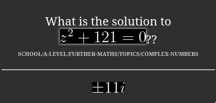
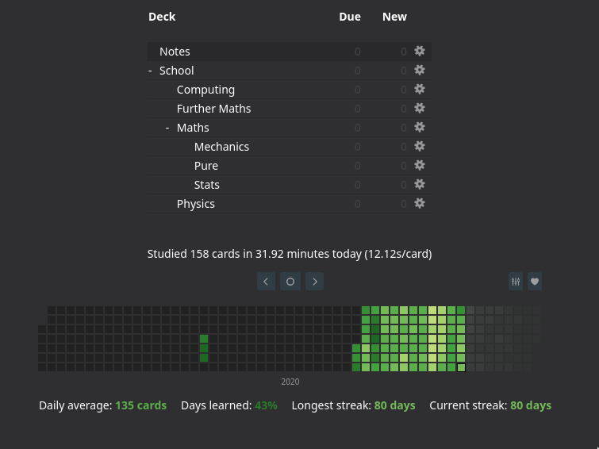

# `notes-school`
These are my GCSE and A-level notes that I take using [`go-albatross`](https://github.com/albatross-org/go-albatross). It's a filtered export of a larger Albatross store. The actual set of notes are version controlled, this is just a 

## Layout
See the entry [`A-Level Note Taking System`](notes/school/a-level/general/transition/note-taking/entry.md).

## Why are there so many question marks??
These are flashcards. There's a program within [`go-albatross`](https://github.com/albatross-org/go-albatross) called `ankify` which takes notes written in this format and outputs a TSV file which can be imported into [Anki](https://apps.ankiweb.net/).

For example:

```
$ albatross get -p school/a-level/further-maths/topics/complex-numbers ankify

How often does the series [$]i^n[/$] repeat??   <p>Every 4 terms.</p>   school/a-level/further-maths/topics/complex-numbers
What is [$]i^3[/$]??    <p>[$]-i[/$]</p>        school/a-level/further-maths/topics/complex-numbers
What is [$]i^{75}[/$]?? <p>[$]-i[/$].</p>       school/a-level/further-maths/topics/complex-numbers
What is the solution to [$]z^2 + 121 = 0[/$]??  <p>[$$]11i[/$$]</p>     school/a-level/further-maths/topics/complex-numbers
What is the set of complex numbers called??     <p>[$]\mathbb{C}[/$]</p>        school/a-level/further-maths/topics/complex-numbers
...
```

Then becomes...





Anki's great because it means you're constantly reviewing everything that you learn and basically never forget anything. Some great essays on Anki flashcards:

- [Augmenting Long-term Memory](http://augmentingcognition.com/ltm.html)
- [Using spaced repetition systems to see through a piece of mathematics](http://cognitivemedium.com/srs-mathematics)
- [Spaced Repetition for Efficient Learning](https://www.gwern.net/Spaced-repetition)

## Why are there so many dollar signs??
These specify a region of [Latex math mode](https://www.overleaf.com/learn/latex/display_style_in_math_mode) which make all the maths look pretty when viewing them in Anki.

## Why are there so many `entry.md` files??
That's how [Albatross](https://github.com/albatross-org/go-albatross) has everything laid out.  

## Why is everything so wrong??
There's a lot of incorrect notes. When I notice something is incorrect, I'll update the Anki flashcard and then most of the time to actually forget to update the note. Maybe one day it will actually be up to date.

## Some entries are missing??
How do you know that? I've omitted a few of the notes because they have sensitive stuff like where I go to school or the names of teachers.

## How is this generated??
There's a `.gitignore`d file called `generate.sh` which looks something like this:

```sh
#!/bin/sh

echo "Removing previous notes folder..."
rm -r notes/

albatross get \
    --path "school" \
    --tag-not "@?private" \
    --tag-not "@?lessons" \
    export albatross -o notes

echo ""
echo "Searching for some secret strings... the output should be empty:"

# Teacher Names
grep -i -r 'mr secret person' notes/
grep -i -r 'mrs secret person' notes/

# ...
```

So entries that I've marked as private don't get included.