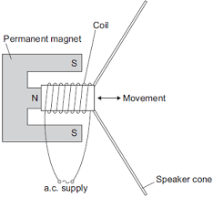

Loudspeakers work by using [[The Motor Effect]]. The technical name that we need to know at GCSE is a moving-coil loudspeaker. These are set up like so:

We find these in both speakers and headphones, though the ones in headphones are very small. In the diagram you can see a cone with a wire wrapped around one of the ends. This wire is then attached to a AC power supply.

Because of [[The Motor Effect]], a current running through this wire will generate a magnetic field and interact with the permenant magnet that it is next to. As the AC supply alternates, it will move the cone in and out causing vibrations in the air which become the sounds that we hear.

##### How does the frequency and amplitude of an AC power supply affect the output of a moving-coil loudspeaker??
A lower frequency will produce a lower sound, and a higher frequency will produce a higher sound. A bigger amplitude will make it louder.

##### How does a loudspeaker convert electical signals into sound waves??
A loudspeaker is made from a coil of wrapped around a cone connected to an AC power supply. This coil of wire is then placed near a permenant magnet. Because of the motor effect, a current running through the wire will generate a magentic field which interacts with the permenant magnet, causing the components to either attract or repel each other. These forces will cause the paper cone to move in and out which in turn causes vibrations in the air that are sound waves.