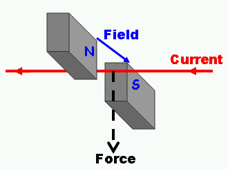

##### What is the motor effect??
The motor effect is something that happens whenever you put a current-carying wire in a magnetic field. When a conductor is put between magnetic poles, the magnetic field around the wire interacts with the magnetic field it has been placed in. This causes the magnet and the conductor to exert a force on each other. This is causes the wire to move.

##### How does the angle of the wire in relation a magnetic field affect the motor effect??
A wire has to be at 90°, perpindicular to the magnetic field to experience the full force. If the wire runs parralel to the magnetic field, it won't experience any force at all. At angles in between, it will experience some force.

##### What increases the strength of the motor effect??
* The strength of the magnetic field (i.e. the magnetic flux density)
* The size of the current through the conductor
* The length of the conductor in the magnetic field

##### What is the equation for the strength of the motor effect when the conductor is at 90 degrees to the magnetic field??
[latex]
F = BIl
[/latex]

Where:
* [latex]F[/latex] = Force (newtons, N)
* [latex]B[/latex] = Magnetic flux density (teslas, T)
* [latex]I[/latex] = Current (amps, A)
* [latex]l[/laetx] = Length (metres, m)

##### What is Fleming's Left-Hand Rule??
Fleming's left hand rule is a way of finding the direction of the force produced by the motor effect.

1. Using your left hand, point your first finger in the direction of the magnetic field (**F**irst **F**inger **F**ield)
2. Point your second finger in the direction of the current (se**C**ond finger **C**urrent)
3. Your thumb will point in the direction of the force (thu**M**b **M**otion)

##### What happens in terms of the motor effect if the current or magnetic field is reversed??
The force will also be reversed.

##### What is the force produced by a 20cm force of wire with a current of 8A at 90° to a 0.1T magnetic field??
16N.
